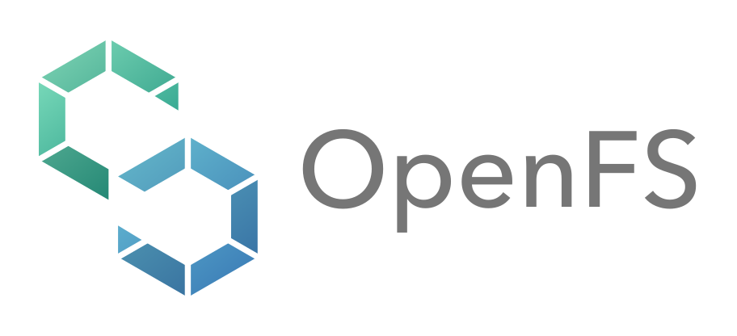

  

  <a href="https://hpci-cfsp.github.io/OpenFS/"><strong>OpenFS Pages</strong></a>
  | <a href="README.md">English</a>

# OpenFS 公開調査成果

OpenFSは、将来のシステム整備計画の検討に向けて、計算機アーキテクチャ、
システムソフトウェア、アプリケーション、運用技術、調達、制度に関する
公開情報を継続的に整理する取り組みです。調査結果とロードマップには、
暫定状態、Coverage Gap、Consensusの状況を併記します。

このリポジトリは、OpenFSの**公開用配布面**です。確認済みの公開データ、
根拠、報告書、承認済みシナリオデータ、生成済みの静的サイトだけを収録します。
調査自動化、生成処理、テスト、内部レビュー、実行記録は公開リポジトリの外で
管理します。

## 収録内容

| パス | 役割 |
| --- | --- |
| `public-site/` | GitHub Pagesへ配信する生成済み静的サイト |
| `knowledge/public/` | 公開用の構造化された調査結果、根拠索引、監査結果 |
| `roadmaps/scenarios/accepted/` | 公開を承認したシナリオデータ |
| `reports/exports/` | 公開用報告書 |
| `assets/branding/` | OpenFSの公開ブランド素材 |
| `PUBLICATION_MANIFEST.json` | 公開バンドルの入力コミット、検証状態、ファイルハッシュ |

公開範囲、検証方法、更新手順は[PUBLICATION.md](PUBLICATION.md)を参照してください。
訂正や追加調査の依頼は、[Feedback](https://hpci-cfsp.github.io/OpenFS/feedback/?lang=ja)
から送信できます。

## ライセンス

OpenFSには[Apache License 2.0](LICENSE)を適用します。第三者資料には元の利用条件が
適用されます。詳しくは[THIRD_PARTY_NOTICES.md](THIRD_PARTY_NOTICES.md)を参照してください。
