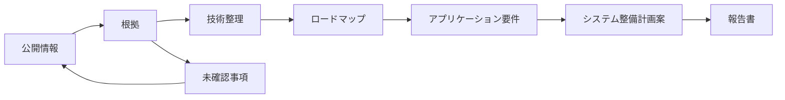

# FS3.0システム整備計画の判断根拠パッケージ

基準日: 2026-09-06 / Status: provisional / Consensus: incomplete

HPCI 27システム、公開調達13案件、EEA1 6アプリ、19ロードマップを、報告書の章構成と追跡可能な形で接続した暫定資料です。未公表値、未校正予測、未承認の閾値は埋めていません。

> 単一のAIモデル・単一エージェントによる公開情報ベースの暫定整理です。独立したAIモデルによるConsensus Gate、各責任者による要件・閾値・予算・調達判断は未完了です。充足数は調査範囲であり、案の点数や推奨順位を示すものではありません。

## 1. 判断準備度の要約

| 対象 | 登録数 | 現在確認できる範囲 | 判断上の境界 |
|---|---:|---|---|
| HPCIシステム | 27 | 将来時期 9、運用根拠 12、電力根拠 1 | 未確認を更新予定・ゼロ値として扱わない |
| 公開調達 | 13 | 総額 11、公開仕様 1、60か月費用下限 1 | 費目別の価格内訳 0件、完全なTCO 0件 |
| EEA1 | 6 | コード版固定 4、入力版固定 1 | 完全な再現パッケージ 0件、承認済み閾値 0件、検証済み予測 0件 |
| ロードマップ | 19 | 385マイルストーン、29依存関係 | Consensus Gate未完了 |

## 2. Web調査自動化のセキュリティ境界

状態: **blocked**。本番利用可能なセキュリティプロファイルは0件、確認待ちの情報源は84件です。安全性を自己証明せず、プロファイルを実環境で検証するまでは全URLの再確認を実行しません。

- `deploy-and-verify-security-profile`: 管理Web検索、匿名Safe Fetch、SSRF防止、Shell外向き通信遮断、依存取得分離、Git公開制限を実環境で検証します。
- `record-owner-attestations`: GitHubとプロバイダー側の外部設定を確認し、秘密情報を含まない有効期限付き証明を記録します。
- `select-production-profile`: 上記の検証後だけ、`OPENFS_SECURITY_PROFILE_ID`にproduction_eligibleなProfile IDを設定します。
- `refresh-and-triage-roadmap-sources`: Safe Web Fetch Brokerによる全URL監査を実行し、取得結果と本文確認を分離したまま未解決項目を再審査します。

## 3. HPCI 27システムの計画根拠

| システム | センター | 将来時期 | 運用根拠 | 電力・施設根拠 | 次の確認 |
|---|---|---|---|---|---|
| スーパーコンピュータ 富岳 | `CENTER-RIKEN-RCCS` | 過去・現況のみ | 根拠登録済み (10) | 公開根拠未確認 (0) | 公開一次情報で更新・終了・増強の将来時期、同一境界の設計・運転電力と冷却条件を確認する。 |
| Wisteria/BDEC-01 Odyssey | `CENTER-UTOKYO-ITC` | 将来時期の公開根拠あり | 根拠登録済み (1) | 公開根拠未確認 (0) | 公開一次情報で同一境界の設計・運転電力と冷却条件を確認する。 |
| SQUID 汎用CPUノード群 | `CENTER-OSAKA-D3` | 将来時期の公開根拠あり | 根拠登録済み (2) | 公開根拠未確認 (0) | 公開一次情報で同一境界の設計・運転電力と冷却条件を確認する。 |
| OCTOPUS 汎用CPUノード群 | `CENTER-OSAKA-D3` | 過去・現況のみ | 公開根拠未確認 (0) | 公開根拠未確認 (0) | 公開一次情報で更新・終了・増強の将来時期、稼働率・可用性・ジョブ履歴等の運用実績、同一境界の設計・運転電力と冷却条件を確認する。 |
| Camphor3 システムA | `CENTER-KYOTO-ACCMS` | 過去・現況のみ | 根拠登録済み (5) | 公開根拠未確認 (0) | 公開一次情報で更新・終了・増強の将来時期、同一境界の設計・運転電力と冷却条件を確認する。 |
| 玄界 ノードグループA | `CENTER-KYUSHU-RIIT` | 過去・現況のみ | 公開根拠未確認 (0) | 公開根拠未確認 (0) | 公開一次情報で更新・終了・増強の将来時期、稼働率・可用性・ジョブ履歴等の運用実績、同一境界の設計・運転電力と冷却条件を確認する。 |
| Grand Chariot 2 CPUノード | `CENTER-HOKKAIDO-IIC` | 過去・現況のみ | 公開根拠未確認 (0) | 公開根拠未確認 (0) | 公開一次情報で更新・終了・増強の将来時期、稼働率・可用性・ジョブ履歴等の運用実績、同一境界の設計・運転電力と冷却条件を確認する。 |
| HOKUSAI BigWaterfall2 | `CENTER-RIKEN-IRDS` | 将来時期の公開根拠あり | 公開根拠未確認 (0) | 公開根拠未確認 (0) | 公開一次情報で稼働率・可用性・ジョブ履歴等の運用実績、同一境界の設計・運転電力と冷却条件を確認する。 |
| Miyabi-C 汎用CPUノード群 | `CENTER-JCAHPC` | 過去・現況のみ | 公開根拠未確認 (0) | 公開根拠未確認 (0) | 公開一次情報で更新・終了・増強の将来時期、稼働率・可用性・ジョブ履歴等の運用実績、同一境界の設計・運転電力と冷却条件を確認する。 |
| 不老・弐 Type Iサブシステム | `CENTER-NAGOYA-ITC` | 将来時期の公開根拠あり | 公開根拠未確認 (0) | 公開根拠未確認 (0) | 公開一次情報で稼働率・可用性・ジョブ履歴等の運用実績、同一境界の設計・運転電力と冷却条件を確認する。 |
| 地球シミュレータ CPUノード部 ES4CPU | `CENTER-JAMSTEC-CEIST` | 過去・現況のみ | 根拠登録済み (2) | 公開根拠未確認 (0) | 公開一次情報で更新・終了・増強の将来時期、同一境界の設計・運転電力と冷却条件を確認する。 |
| AOBA-B LX 406Rz-2 | `CENTER-TOHOKU-CSC` | 過去・現況のみ | 公開根拠未確認 (0) | 公開根拠未確認 (0) | 公開一次情報で更新・終了・増強の将来時期、稼働率・可用性・ジョブ履歴等の運用実績、同一境界の設計・運転電力と冷却条件を確認する。 |
| データ同化スーパーコンピュータシステム | `CENTER-ISM-CSST` | 過去・現況のみ | 公開根拠未確認 (0) | 公開根拠未確認 (0) | 公開一次情報で更新・終了・増強の将来時期、稼働率・可用性・ジョブ履歴等の運用実績、同一境界の設計・運転電力と冷却条件を確認する。 |
| 不老・弐 Type IIサブシステム | `CENTER-NAGOYA-ITC` | 将来時期の公開根拠あり | 公開根拠未確認 (0) | 公開根拠未確認 (0) | 公開一次情報で稼働率・可用性・ジョブ履歴等の運用実績、同一境界の設計・運転電力と冷却条件を確認する。 |
| Miyabi-G 演算加速ノード群 | `CENTER-JCAHPC` | 過去・現況のみ | 公開根拠未確認 (0) | 公開根拠未確認 (0) | 公開一次情報で更新・終了・増強の将来時期、稼働率・可用性・ジョブ履歴等の運用実績、同一境界の設計・運転電力と冷却条件を確認する。 |
| Sirius PACS12.0 | `CENTER-TSUKUBA-CCS` | 過去・現況のみ | 公開根拠未確認 (0) | 公開根拠未確認 (0) | 公開一次情報で更新・終了・増強の将来時期、稼働率・可用性・ジョブ履歴等の運用実績、同一境界の設計・運転電力と冷却条件を確認する。 |
| TSUBAME4.0 | `CENTER-SCIENCE-TOKYO-IIC` | 過去・現況のみ | 根拠登録済み (2) | 電力根拠登録済み (2) | 公開一次情報で更新・終了・増強の将来時期を確認する。 |
| 玄界 ノードグループB | `CENTER-KYUSHU-RIIT` | 過去・現況のみ | 公開根拠未確認 (0) | 公開根拠未確認 (0) | 公開一次情報で更新・終了・増強の将来時期、稼働率・可用性・ジョブ履歴等の運用実績、同一境界の設計・運転電力と冷却条件を確認する。 |
| Pegasus | `CENTER-TSUKUBA-CCS` | 過去・現況のみ | 公開根拠未確認 (0) | 公開根拠未確認 (0) | 公開一次情報で更新・終了・増強の将来時期、稼働率・可用性・ジョブ履歴等の運用実績、同一境界の設計・運転電力と冷却条件を確認する。 |
| Wisteria/BDEC-01 Aquarius | `CENTER-UTOKYO-ITC` | 将来時期の公開根拠あり | 根拠登録済み (1) | 公開根拠未確認 (0) | 公開一次情報で同一境界の設計・運転電力と冷却条件を確認する。 |
| SQUID GPUノード群 | `CENTER-OSAKA-D3` | 将来時期の公開根拠あり | 根拠登録済み (2) | 公開根拠未確認 (0) | 公開一次情報で同一境界の設計・運転電力と冷却条件を確認する。 |
| Grand Chariot 2 GPUノード | `CENTER-HOKKAIDO-IIC` | 将来時期の公開根拠あり | 公開根拠未確認 (0) | 公開根拠未確認 (0) | 公開一次情報で稼働率・可用性・ジョブ履歴等の運用実績、同一境界の設計・運転電力と冷却条件を確認する。 |
| AOBA-A | `CENTER-TOHOKU-CSC` | 過去・現況のみ | 公開根拠未確認 (0) | 公開根拠未確認 (0) | 公開一次情報で更新・終了・増強の将来時期、稼働率・可用性・ジョブ履歴等の運用実績、同一境界の設計・運転電力と冷却条件を確認する。 |
| AOBA-S | `CENTER-TOHOKU-CSC` | 過去・現況のみ | 根拠登録済み (3) | 公開根拠未確認 (0) | 公開一次情報で更新・終了・増強の将来時期、同一境界の設計・運転電力と冷却条件を確認する。 |
| 地球シミュレータ VE搭載ノード部 ES4VE | `CENTER-JAMSTEC-CEIST` | 過去・現況のみ | 根拠登録済み (2) | 公開根拠未確認 (0) | 公開一次情報で更新・終了・増強の将来時期、同一境界の設計・運転電力と冷却条件を確認する。 |
| SQUID ベクトルノード群 | `CENTER-OSAKA-D3` | 将来時期の公開根拠あり | 根拠登録済み (2) | 公開根拠未確認 (0) | 公開一次情報で同一境界の設計・運転電力と冷却条件を確認する。 |
| ABCI 3.0 | `CENTER-AIST-IHF` | 過去・現況のみ | 根拠登録済み (1) | 公開根拠未確認 (0) | 公開一次情報で更新・終了・増強の将来時期、同一境界の設計・運転電力と冷却条件を確認する。 |

## 4. 公開調達13案件と5年間費用

| 調達案件 | 公表額 | 仕様書 | 費目根拠 | 60か月費用 | 未確認費目 | 判断への利用 |
|---|---:|---|---:|---:|---:|---|
| 理研 AI for Science用スーパーコンピュータ一式 | 6,731,406,000円 | 公開仕様書を未取得 | 6/12 | 未確認 | 6/12 | 公表総額の比較には使えますが、部品単価や5年間TCOへ分解しません。 |
| 理研 AI for Science用InfiniBandスイッチ一式 | 5,148,000円 | 公開仕様書を未取得 | 1/12 | 未確認 | 11/12 | 公表総額の比較には使えますが、部品単価や5年間TCOへ分解しません。 |
| 理研 AIスーパーコンピュータ設備増強工事（機械） | 341,000,000円 | 公開仕様書を未取得 | 2/12 | 未確認 | 10/12 | 公表総額の比較には使えますが、部品単価や5年間TCOへ分解しません。 |
| 理研 AIスーパーコンピュータ設備増強工事（電気） | 363,000,000円 | 公開仕様書を未取得 | 2/12 | 未確認 | 10/12 | 公表総額の比較には使えますが、部品単価や5年間TCOへ分解しません。 |
| JAXA JSS4 スーパーコンピュータ調達 | 未確認 | アクセス制限あり | 0/12 | 未確認 | 12/12 | 価格根拠がないため費用比較には使用できません。 |
| 名古屋大学「不老」NEXTシステムの借入 | 5,809,518,000円 | 公開仕様書を未取得 | 6/12 | 未確認 | 6/12 | 公表総額の比較には使えますが、部品単価や5年間TCOへ分解しません。 |
| 筑波大学ユニファイドメモリ型スーパーコンピュータの借入 | 11,880,000円 | 公開仕様書を未取得 | 6/12 | 712,800,000円 | 6/12 | 公表された契約範囲に限る60か月費用下限として利用できます。完全なTCOではありません。 |
| 理研 2025年度「富岳」保守 | 6,259,572,132円 | 公開仕様書を未取得 | 1/12 | 未確認 | 11/12 | 公表総額の比較には使えますが、部品単価や5年間TCOへ分解しません。 |
| 理研 2024年度「富岳」保守 | 6,261,801,700円 | 公開仕様書を未取得 | 1/12 | 未確認 | 11/12 | 公表総額の比較には使えますが、部品単価や5年間TCOへ分解しません。 |
| 理研 2025年度「富岳」本体オーバーホール・ネットワークスイッチ更新 | 1,586,200,000円 | 公開仕様書を未取得 | 3/12 | 未確認 | 9/12 | 公表総額の比較には使えますが、部品単価や5年間TCOへ分解しません。 |
| 理研 2026年度「富岳」保守 | 5,958,583,928円 | 公開仕様書を未取得 | 1/12 | 未確認 | 11/12 | 公表総額の比較には使えますが、部品単価や5年間TCOへ分解しません。 |
| 情報・システム研究機構 AI技術開発用GPUサーバ | 79,970,000円 | 公開仕様書を未取得 | 0/12 | 未確認 | 12/12 | 公表総額の比較には使えますが、部品単価や5年間TCOへ分解しません。 |
| 京都大学 ゲノム科学・計算化学向け次期スーパーコンピュータ要求要件 | 未確認 | 公開仕様書を確認済み | 0/12 | 未確認 | 12/12 | 価格根拠がないため費用比較には使用できません。 |

## 5. EEA1再現性と性能評価

`1 / 4 / 32 / 128 / 1024 / 10000`ノードを共通表示軸とします。異なる入力の実測は、同一入力の性能予測の校正点として扱いません。

| アプリケーション | コード版 | 入力版 | 確認済み成果物 | 不足成果物 | 公開実測ノード | 閾値・予測 |
|---|---|---|---|---|---|---|
| GENESIS | v2.1.6.1 | v1.0.0 | code, input, code-license, content-digest | dependencies, run-procedure, reference-output, input-license | 2, 16, 32, 64, 128, 256, 512, 1024, 2048, 4096, 8192, 16384 | 閾値未承認 / 検証済み予測なし |
| SALMON | v.2.3.0 | 未確認 | code, code-license, content-digest | input, dependencies, run-procedure, reference-output, input-license | 1, 432, 1728, 6912, 27648 | 閾値未承認 / 検証済み予測なし |
| SCALE-LETKF | 5.5.5-v2 | 未確認 | code, code-license, content-digest | input, dependencies, run-procedure, reference-output, input-license | 1 | 閾値未承認 / 検証済み予測なし |
| E-Wave | 未確認 | 未確認 | なし | code, input, dependencies, run-procedure, reference-output, code-license, input-license, content-digest | 385 | 閾値未承認 / 検証済み予測なし |
| FrontFlow/blue | 未確認 | 未確認 | なし | code, input, dependencies, run-procedure, reference-output, code-license, input-license, content-digest | 1 | 閾値未承認 / 検証済み予測なし |
| LQCD-DWF-HMC | main snapshot | 未確認 | code, code-license, content-digest | input, dependencies, run-procedure, reference-output, input-license | 1 | 閾値未承認 / 検証済み予測なし |

## 6. アプリケーション需要からシステム要件へ

定性的な`high / medium / low / unknown`は設計上の注意点であり、採用閾値や点数ではありません。数値がある場合も、公開実測範囲または公開目標として保持します。

| アプリケーション | 高い要求が想定される軸 | 定量要件・実測範囲 | 測定不足セル |
|---|---|---|---:|
| GENESIS | compute-throughput, memory-capacity-bandwidth, scale-out-interconnect | REQ-PERF-GENESIS-SCALE | 8 |
| SALMON | compute-throughput, memory-capacity-bandwidth, scale-out-interconnect | REQ-PERF-SALMON-SCALE, REQ-PERF-SALMON-STEP-TARGET | 8 |
| SCALE-LETKF | compute-throughput, data-governance, memory-capacity-bandwidth, scale-out-interconnect, storage-io, workflow-latency | REQ-PERF-SCALE-LETKF-SCALE | 8 |
| E-Wave | compute-throughput, memory-capacity-bandwidth, scale-out-interconnect, storage-io | REQ-PERF-EWAVE-GAP, REQ-PERF-EWAVE-MEASURED | 8 |
| FrontFlow/blue | compute-throughput, memory-capacity-bandwidth, scale-out-interconnect, storage-io, workflow-latency | REQ-PERF-FFB-SCALE | 8 |
| LQCD-DWF-HMC | compute-throughput, memory-capacity-bandwidth, scale-out-interconnect | REQ-PERF-LQCD-SCALE | 8 |

## 7. 公開ロードマップと依存関係

| ロードマップ | マイルストーン | 四半期未特定 | 未確認事項 (P0/P1/P2) |
|---|---:|---:|---:|
| [利用支援・ソフトウェア持続性・運営体制](https://hpci-cfsp.github.io/OpenFS/roadmaps/applications/workforce-adoption-sustainability/?lang=ja) | 6 | 1 | 0/2/0 |
| [AI for Science・科学AIエージェント](https://hpci-cfsp.github.io/OpenFS/roadmaps/applications/ai-for-science-agents/?lang=ja) | 4 | 2 | 0/1/1 |
| [緊急・リアルタイム・実験連携・量子応用](https://hpci-cfsp.github.io/OpenFS/roadmaps/applications/realtime-experiment-quantum/?lang=ja) | 8 | 1 | 0/2/0 |
| [科学ワークロード・ベンチマーク・性能モデル](https://hpci-cfsp.github.io/OpenFS/roadmaps/applications/workloads-benchmarks-models/?lang=ja) | 38 | 5 | 4/4/1 |
| [計算ノード・プロセッサ・アクセラレータ](https://hpci-cfsp.github.io/OpenFS/roadmaps/hardware/compute-nodes-accelerators/?lang=ja) | 55 | 1 | 3/5/1 |
| [施設・電力・冷却](https://hpci-cfsp.github.io/OpenFS/roadmaps/hardware/facility-power-cooling/?lang=ja) | 5 | 1 | 0/1/1 |
| [インターコネクト・光・資源分離](https://hpci-cfsp.github.io/OpenFS/roadmaps/hardware/interconnect-optics-disaggregation/?lang=ja) | 35 | 3 | 2/3/1 |
| [メモリ・データ移動技術ロードマップ（2026年以降）](https://hpci-cfsp.github.io/OpenFS/roadmaps/hardware/memory-data-movement/?lang=ja) | 62 | 12 | 1/3/2 |
| [供給網・技術主権・ライフサイクル](https://hpci-cfsp.github.io/OpenFS/roadmaps/hardware/supply-sovereignty-lifecycle/?lang=ja) | 7 | 0 | 0/2/0 |
| [ストレージ・データ基盤](https://hpci-cfsp.github.io/OpenFS/roadmaps/hardware/storage-data-platforms/?lang=ja) | 19 | 5 | 1/1/1 |
| [可観測性・性能工学・電力適応運用](https://hpci-cfsp.github.io/OpenFS/roadmaps/system-software/observability-performance-power/?lang=ja) | 5 | 1 | 0/2/0 |
| [性能可搬性・コンパイラ・自動最適化](https://hpci-cfsp.github.io/OpenFS/roadmaps/system-software/portability-compilers-tuning/?lang=ja) | 47 | 5 | 4/5/1 |
| [通信・ランタイム・スケジューリング・OS](https://hpci-cfsp.github.io/OpenFS/roadmaps/system-software/runtime-scheduling-os/?lang=ja) | 4 | 2 | 0/1/1 |
| [認証・セキュリティ・連合運用](https://hpci-cfsp.github.io/OpenFS/roadmaps/system-software/identity-security-federation/?lang=ja) | 4 | 2 | 0/1/1 |
| [データ・AI・実験ワークフロー基盤](https://hpci-cfsp.github.io/OpenFS/roadmaps/system-software/data-workflow-platform/?lang=ja) | 4 | 2 | 0/1/1 |
| [参照構成・HPCI基盤センター導入](https://hpci-cfsp.github.io/OpenFS/roadmaps/cross-cutting/reference-blueprint-centers/?lang=ja) | 70 | 4 | 6/2/0 |
| [技術動向監視・新規調査項目発見](https://hpci-cfsp.github.io/OpenFS/roadmaps/cross-cutting/horizon-scanning-topic-discovery/?lang=ja) | 4 | 1 | 0/1/1 |
| [統合運用・ガバナンス・サービス継続](https://hpci-cfsp.github.io/OpenFS/roadmaps/cross-cutting/operations-governance-continuity/?lang=ja) | 4 | 2 | 0/1/1 |
| [調達・共同投資・システム整備計画案](https://hpci-cfsp.github.io/OpenFS/roadmaps/cross-cutting/procurement-investment-scenarios/?lang=ja) | 4 | 2 | 0/1/1 |

## 8. 報告書の章構成と根拠

- **CH-01 目的・対象・方法と情報境界**: 公開情報だけを用いる調査範囲、更新方法、セキュリティ、Consensus状態を示します。 根拠: `config/research-web-security-policy.json`, `knowledge/public/audits/roadmap-source-triage.json`
- **CH-02 HPCIシステムの現況と更新制約**: 27システムの構成、将来時期、運用実績、施設根拠の有無を比較します。 根拠: `knowledge/public/hpci-system-inventory.json`, `RM-X-BLUEPRINT`
- **CH-03 技術・供給・施設ロードマップ**: 計算、メモリ、接続、ストレージ、施設、供給網を四半期単位で比較します。 根拠: `knowledge/public/roadmaps`, `knowledge/public/dependencies/p0-roadmap-dependencies.json`
- **CH-04 システムソフトウェアと運用準備**: 移植性、ランタイム、ワークフロー、セキュリティ、可観測性の依存関係を示します。 根拠: `RM-SSW-PORTABILITY`, `RM-SSW-RUNTIME`, `RM-SSW-WORKFLOW`, `RM-SSW-SECURITY`, `RM-SSW-PERFORMANCE`
- **CH-05 アプリケーション需要と性能評価**: EEA1の再現可能性、測定範囲、定量要件、未承認の合否条件を分離します。 根拠: `knowledge/public/application-performance-forecasts.json`, `RM-APP-WORKLOADS`
- **CH-06 調達実績とライフサイクル費用**: 13案件の公表総額、仕様書、費目範囲、5年費用の計算可否を示します。 根拠: `knowledge/public/procurement-cost-register.json`, `RM-X-PROCUREMENT`
- **CH-07 複数のシステム整備計画案**: 同じ11評価軸と依存関係で3案を比較し、予算・数量・採否は人の判断として残します。 根拠: `knowledge/public/planning-evidence-readiness.json`, `roadmaps/scenarios/accepted`
- **CH-08 未確認事項、検証計画、来歴**: 不足根拠、責任者、次の測定・調査、Consensus Gate、更新履歴を示します。 根拠: `knowledge/public/audits/roadmap-gap-queue.json`, `reviews/consensus-packages`, `reviews/directives/DIR-900104.json`

## English summary

A provisional package connecting 27 HPCI systems, 13 public procurement cases, six EEA1 applications, and 19 roadmaps to a report structure with traceable evidence. Undisclosed values, uncalibrated forecasts, and unapproved thresholds remain unset.

> A provisional public-information synthesis by one model and one agent. The Consensus Gate using independent models and accountable approval of requirements, thresholds, budgets, and procurement decisions are incomplete. Coverage counts are research scope, not scores or rankings.

- Secure unattended Web research: **blocked**; 84 source-triage entries remain unresolved.
- HPCI inventory: 27 systems; 9 have public future lifecycle timing, 12 have registered operational evidence, and power evidence is registered for 1 systems.
- Procurement: 13 cases; 11 public totals, 0 itemized cases, and 0 complete five-year TCO cases.
- EEA1: 6 applications; 0 complete reproducibility packages, 0 approved thresholds, and 0 validated forecasts.
- Roadmaps: 19 provisional public roadmaps and 29 registered cross-roadmap dependencies.

Machine-readable source: `knowledge/public/fs3-decision-evidence.json`
