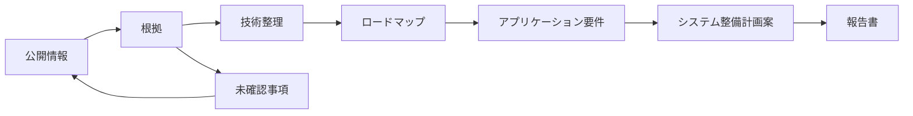

# FS3.0システム整備計画の判断根拠パッケージ

基準日: 2026-09-06 / Status: provisional / Consensus: incomplete

HPCI 27システム、公開調達16案件、EEA1 6アプリ、19ロードマップを、報告書の章構成と追跡可能な形で接続した暫定資料です。未公表値、未校正予測、未承認の閾値は埋めていません。

> 単一のAIモデル・単一エージェントによる公開情報ベースの暫定整理です。独立したAIモデルによるConsensus Gate、各責任者による要件・閾値・予算・調達判断は未完了です。充足数は調査範囲であり、案の点数や推奨順位を示すものではありません。

## 1. 判断準備度の要約

| 対象 | 登録数 | 現在確認できる範囲 | 判断上の境界 |
|---|---:|---|---|
| HPCIシステム | 27 | 将来時期 15、数値運用実績 16、公開集計 8、公開運用フィード 11、電力根拠 5 | 状態フィードと集計値を区別し、未確認を更新予定・ゼロ値として扱わない |
| 公開調達 | 16 | 契約・落札総額 12、概算年額 1、公開仕様 5、60か月費用下限 2 | 費目別の価格内訳 0件、完全なTCO 0件 |
| EEA1 | 6 | コード版固定 4、入力版固定 1、公開プロキシ 2 | 完全な再現パッケージ 0件、承認済み閾値 0件、検証済み予測 0件 |
| ロードマップ | 19 | 393マイルストーン、30依存関係 | Consensus Gate未完了 |

## 2. Web調査自動化のセキュリティ境界

状態: **blocked**。本番利用可能なセキュリティプロファイルは0件、確認待ちの情報源は84件です。安全性を自己証明せず、プロファイルを実環境で検証するまでは全URLの再確認を実行しません。

- `deploy-and-verify-security-profile`: 管理Web検索、匿名Safe Fetch、SSRF防止、Shell外向き通信遮断、依存取得分離、Git公開制限を実環境で検証します。
- `record-owner-attestations`: GitHubとプロバイダー側の外部設定を確認し、秘密情報を含まない有効期限付き証明を記録します。
- `select-production-profile`: 上記の検証後だけ、`OPENFS_SECURITY_PROFILE_ID`にproduction_eligibleなProfile IDを設定します。
- `refresh-and-triage-roadmap-sources`: Safe Web Fetch Brokerによる全URL監査を実行し、取得結果と本文確認を分離したまま未解決項目を再審査します。

## 3. HPCI 27システムの計画根拠

公開運用フィードは障害・保守・現在状態の追跡経路であり、稼働率や年度可用性の集計値ではありません。認証付き利用者ポータルも公開集計には数えません。

| システム | センター | 将来時期 | 運用根拠 | 数値/集計/状態/認証 | 電力・施設根拠 | 次の確認 |
|---|---|---|---|---|---|---|
| スーパーコンピュータ 富岳 | `CENTER-RIKEN-RCCS` | 過去・現況のみ | 数値実績あり | 9/2/0/0 | 電力根拠登録済み (1) | 公開一次情報で更新・終了・増強の将来時期を確認する。 |
| Wisteria/BDEC-01 Odyssey | `CENTER-UTOKYO-ITC` | 将来時期の公開根拠あり | 数値実績あり | 1/0/0/0 | 公開根拠未確認 (0) | 公開一次情報で同一境界の設計・運転電力と冷却条件を確認する。 |
| SQUID 汎用CPUノード群 | `CENTER-OSAKA-D3` | 将来時期の公開根拠あり | 数値実績あり | 1/1/0/0 | 公開根拠未確認 (0) | 公開一次情報で同一境界の設計・運転電力と冷却条件を確認する。 |
| OCTOPUS 汎用CPUノード群 | `CENTER-OSAKA-D3` | 将来時期の公開根拠あり | 公開運用フィードのみ | 0/0/1/1 | 公開根拠未確認 (0) | 公開一次情報で稼働率・可用性・ジョブ履歴等の運用実績、同一境界の設計・運転電力と冷却条件を確認する。 |
| Camphor3 システムA | `CENTER-KYOTO-ACCMS` | 将来時期の公開根拠あり | 数値実績あり | 5/0/0/0 | 公開根拠未確認 (0) | 公開一次情報で同一境界の設計・運転電力と冷却条件を確認する。 |
| 玄界 ノードグループA | `CENTER-KYUSHU-RIIT` | 過去・現況のみ | 公開集計あり | 0/1/0/0 | 公開根拠未確認 (0) | 公開一次情報で更新・終了・増強の将来時期、同一境界の設計・運転電力と冷却条件を確認する。 |
| Grand Chariot 2 CPUノード | `CENTER-HOKKAIDO-IIC` | 過去・現況のみ | 公開運用フィードのみ | 0/0/1/0 | 公開根拠未確認 (0) | 公開一次情報で更新・終了・増強の将来時期、稼働率・可用性・ジョブ履歴等の運用実績、同一境界の設計・運転電力と冷却条件を確認する。 |
| HOKUSAI BigWaterfall2 | `CENTER-RIKEN-IRDS` | 将来時期の公開根拠あり | 数値実績あり | 1/0/1/0 | 公開根拠未確認 (0) | 公開一次情報で同一境界の設計・運転電力と冷却条件を確認する。 |
| Miyabi-C 汎用CPUノード群 | `CENTER-JCAHPC` | 過去・現況のみ | 数値実績あり | 1/0/1/0 | 電力根拠登録済み (1) | 公開一次情報で更新・終了・増強の将来時期を確認する。 |
| 不老・弐 Type Iサブシステム | `CENTER-NAGOYA-ITC` | 将来時期の公開根拠あり | 公開根拠未確認 | 0/0/0/0 | 公開根拠未確認 (0) | 公開一次情報で稼働率・可用性・ジョブ履歴等の運用実績、同一境界の設計・運転電力と冷却条件を確認する。 |
| 地球シミュレータ CPUノード部 ES4CPU | `CENTER-JAMSTEC-CEIST` | 将来時期の公開根拠あり | 数値実績あり | 1/1/0/0 | 公開根拠未確認 (0) | 公開一次情報で同一境界の設計・運転電力と冷却条件を確認する。 |
| AOBA-B LX 406Rz-2 | `CENTER-TOHOKU-CSC` | 過去・現況のみ | 公開運用フィードのみ | 0/0/1/1 | 公開根拠未確認 (0) | 公開一次情報で更新・終了・増強の将来時期、稼働率・可用性・ジョブ履歴等の運用実績、同一境界の設計・運転電力と冷却条件を確認する。 |
| データ同化スーパーコンピュータシステム | `CENTER-ISM-CSST` | 過去・現況のみ | 公開運用フィードのみ | 0/0/1/0 | 公開根拠未確認 (0) | 公開一次情報で更新・終了・増強の将来時期、稼働率・可用性・ジョブ履歴等の運用実績、同一境界の設計・運転電力と冷却条件を確認する。 |
| 不老・弐 Type IIサブシステム | `CENTER-NAGOYA-ITC` | 将来時期の公開根拠あり | 公開根拠未確認 | 0/0/0/0 | 公開根拠未確認 (0) | 公開一次情報で稼働率・可用性・ジョブ履歴等の運用実績、同一境界の設計・運転電力と冷却条件を確認する。 |
| Miyabi-G 演算加速ノード群 | `CENTER-JCAHPC` | 過去・現況のみ | 数値実績あり | 1/0/1/0 | 電力根拠登録済み (1) | 公開一次情報で更新・終了・増強の将来時期を確認する。 |
| Sirius PACS12.0 | `CENTER-TSUKUBA-CCS` | 過去・現況のみ | 公開運用フィードのみ | 0/0/1/0 | 公開根拠未確認 (0) | 公開一次情報で更新・終了・増強の将来時期、稼働率・可用性・ジョブ履歴等の運用実績、同一境界の設計・運転電力と冷却条件を確認する。 |
| TSUBAME4.0 | `CENTER-SCIENCE-TOKYO-IIC` | 将来時期の公開根拠あり | 数値実績あり | 6/0/0/0 | 電力根拠登録済み (2) | 確認済みの範囲を維持する。 |
| 玄界 ノードグループB | `CENTER-KYUSHU-RIIT` | 過去・現況のみ | 公開集計あり | 0/1/0/0 | 公開根拠未確認 (0) | 公開一次情報で更新・終了・増強の将来時期、同一境界の設計・運転電力と冷却条件を確認する。 |
| Pegasus | `CENTER-TSUKUBA-CCS` | 過去・現況のみ | 公開運用フィードのみ | 0/0/1/0 | 公開根拠未確認 (0) | 公開一次情報で更新・終了・増強の将来時期、稼働率・可用性・ジョブ履歴等の運用実績、同一境界の設計・運転電力と冷却条件を確認する。 |
| Wisteria/BDEC-01 Aquarius | `CENTER-UTOKYO-ITC` | 将来時期の公開根拠あり | 数値実績あり | 1/0/0/0 | 公開根拠未確認 (0) | 公開一次情報で同一境界の設計・運転電力と冷却条件を確認する。 |
| SQUID GPUノード群 | `CENTER-OSAKA-D3` | 将来時期の公開根拠あり | 数値実績あり | 1/1/0/0 | 公開根拠未確認 (0) | 公開一次情報で同一境界の設計・運転電力と冷却条件を確認する。 |
| Grand Chariot 2 GPUノード | `CENTER-HOKKAIDO-IIC` | 将来時期の公開根拠あり | 数値実績あり | 1/0/1/0 | 公開根拠未確認 (0) | 公開一次情報で同一境界の設計・運転電力と冷却条件を確認する。 |
| AOBA-A | `CENTER-TOHOKU-CSC` | 過去・現況のみ | 公開運用フィードのみ | 0/0/1/1 | 公開根拠未確認 (0) | 公開一次情報で更新・終了・増強の将来時期、稼働率・可用性・ジョブ履歴等の運用実績、同一境界の設計・運転電力と冷却条件を確認する。 |
| AOBA-S | `CENTER-TOHOKU-CSC` | 将来時期の公開根拠あり | 数値実績あり | 3/0/0/1 | 公開根拠未確認 (0) | 公開一次情報で同一境界の設計・運転電力と冷却条件を確認する。 |
| 地球シミュレータ VE搭載ノード部 ES4VE | `CENTER-JAMSTEC-CEIST` | 将来時期の公開根拠あり | 数値実績あり | 1/1/0/0 | 公開根拠未確認 (0) | 公開一次情報で同一境界の設計・運転電力と冷却条件を確認する。 |
| SQUID ベクトルノード群 | `CENTER-OSAKA-D3` | 将来時期の公開根拠あり | 数値実績あり | 1/1/0/0 | 公開根拠未確認 (0) | 公開一次情報で同一境界の設計・運転電力と冷却条件を確認する。 |
| ABCI 3.0 | `CENTER-AIST-IHF` | 過去・現況のみ | 数値実績あり | 2/0/0/0 | 電力根拠登録済み (1) | 公開一次情報で更新・終了・増強の将来時期を確認する。 |

## 4. 公開調達16案件と5年間費用

| 調達案件 | 公表額 | 金額区分 | 仕様書 | 費目根拠 | 60か月費用 | 未確認費目 | 判断への利用 |
|---|---:|---|---|---:|---:|---:|---|
| 理研 AI for Science用スーパーコンピュータ一式 | 6,731,406,000円 | 契約総額 | 公開仕様書を確認済み | 6/12 | 未確認 | 6/12 | 公表総額の比較には使えますが、部品単価や5年間TCOへ分解しません。 |
| 理研 AI for Science用InfiniBandスイッチ一式 | 5,148,000円 | 契約総額 | 公開仕様書を未取得 | 1/12 | 未確認 | 11/12 | 公表総額の比較には使えますが、部品単価や5年間TCOへ分解しません。 |
| 理研 AIスーパーコンピュータ設備増強工事（機械） | 341,000,000円 | 契約総額 | 公開仕様書を未取得 | 2/12 | 未確認 | 10/12 | 公表総額の比較には使えますが、部品単価や5年間TCOへ分解しません。 |
| 理研 AIスーパーコンピュータ設備増強工事（電気） | 363,000,000円 | 契約総額 | 公開仕様書を未取得 | 2/12 | 未確認 | 10/12 | 公表総額の比較には使えますが、部品単価や5年間TCOへ分解しません。 |
| JAXA JSS4 スーパーコンピュータ調達 | 未確認 | 未確認 | アクセス制限あり | 0/12 | 未確認 | 12/12 | 価格根拠がないため費用比較には使用できません。 |
| 名古屋大学「不老」NEXTシステムの借入 | 5,809,518,000円 | 落札総額 | 公開仕様書を確認済み | 6/12 | 未確認 | 6/12 | 公表総額の比較には使えますが、部品単価や5年間TCOへ分解しません。 |
| 筑波大学ユニファイドメモリ型スーパーコンピュータの借入 | 11,880,000円 | 落札総額 | 公開仕様書を確認済み | 6/12 | 712,800,000円 | 6/12 | 公表された契約範囲に限る60か月費用下限として利用できます。完全なTCOではありません。 |
| 理研 2025年度「富岳」保守 | 6,259,572,132円 | 契約総額 | 公開仕様書を未取得 | 1/12 | 未確認 | 11/12 | 公表総額の比較には使えますが、部品単価や5年間TCOへ分解しません。 |
| 理研 2024年度「富岳」保守 | 6,261,801,700円 | 契約総額 | 公開仕様書を未取得 | 1/12 | 未確認 | 11/12 | 公表総額の比較には使えますが、部品単価や5年間TCOへ分解しません。 |
| 理研 2025年度「富岳」本体オーバーホール・ネットワークスイッチ更新 | 1,586,200,000円 | 契約総額 | 公開仕様書を未取得 | 3/12 | 未確認 | 9/12 | 公表総額の比較には使えますが、部品単価や5年間TCOへ分解しません。 |
| 理研 2026年度「富岳」保守 | 5,958,583,928円 | 契約総額 | 公開仕様書を未取得 | 1/12 | 未確認 | 11/12 | 公表総額の比較には使えますが、部品単価や5年間TCOへ分解しません。 |
| 情報・システム研究機構 AI技術開発用GPUサーバ | 79,970,000円 | 落札総額 | 公開仕様書を未取得 | 0/12 | 未確認 | 12/12 | 公表総額の比較には使えますが、部品単価や5年間TCOへ分解しません。 |
| 京都大学 ゲノム科学・計算化学向け次期スーパーコンピュータ要求要件 | 未確認 | 未確認 | 公開仕様書を確認済み | 0/12 | 未確認 | 12/12 | 価格根拠がないため費用比較には使用できません。 |
| JAXA JSS4 コンピュータ基盤システム要求要件 | 未確認 | 未確認 | 公開仕様書を確認済み | 0/12 | 未確認 | 12/12 | 価格根拠がないため費用比較には使用できません。 |
| 東京工業大学 TSUBAME4.0スーパーコンピュータの借入 | 84,064,519円 | 落札総額 | 公開仕様書を未取得 | 3/12 | 5,043,871,140円 | 9/12 | 公表された契約範囲に限る60か月費用下限として利用できます。完全なTCOではありません。 |
| HOKUSAI BigWaterfall2 提供機関公表の年間支払額 | 300,000,000円 | 提供機関公表の概算年額 | 仕様書なし | 4/12 | 未確認 | 8/12 | 提供機関公表の概算年額として費用境界の参考にできますが、落札額・契約総額・5年間TCOではありません。 |

## 5. EEA1再現性と性能評価

`1 / 4 / 32 / 128 / 1024 / 10000`ノードを共通表示軸とします。異なる入力の実測は、同一入力の性能予測の校正点として扱いません。公開プロキシも、EEA1入力との一致を責任者が確認するまでは代替基準にしません。

| アプリケーション | コード版 | 入力版 | 公開プロキシ | 確認済み成果物 | 不足成果物 | 公開実測ノード | 閾値・予測 |
|---|---|---|---:|---|---|---|---|
| GENESIS | v2.1.6.1 | v1.0.0 | 0 | code, input, code-license, content-digest | dependencies, run-procedure, reference-output, input-license | 2, 16, 32, 64, 128, 256, 512, 1024, 2048, 4096, 8192, 16384 | 閾値未承認 / 検証済み予測なし |
| SALMON | v.2.3.0 | 未確認 | 2 | code, code-license, content-digest | input, dependencies, run-procedure, reference-output, input-license | 1, 432, 1728, 6912, 27648 | 閾値未承認 / 検証済み予測なし |
| SCALE-LETKF | 5.5.5-v2 | 未確認 | 0 | code, code-license, content-digest | input, dependencies, run-procedure, reference-output, input-license | 1 | 閾値未承認 / 検証済み予測なし |
| E-Wave | 未確認 | 未確認 | 0 | なし | code, input, dependencies, run-procedure, reference-output, code-license, input-license, content-digest | 385 | 閾値未承認 / 検証済み予測なし |
| FrontFlow/blue | 未確認 | 未確認 | 0 | なし | code, input, dependencies, run-procedure, reference-output, code-license, input-license, content-digest | 1 | 閾値未承認 / 検証済み予測なし |
| LQCD-DWF-HMC | main snapshot | 未確認 | 0 | code, code-license, content-digest | input, dependencies, run-procedure, reference-output, input-license | 1 | 閾値未承認 / 検証済み予測なし |

## 6. アプリケーション需要からシステム要件へ

6アプリケーション×8要件軸を48件の暫定システム要件候補として識別しました。定量根拠への接続は13件、定性根拠のみは35件、人による承認済み要件は0件です。定性的な`high / medium / low / unknown`は設計上の注意点であり、採用閾値や点数ではありません。数値がある場合も、公開実測範囲または公開目標として保持します。

| アプリケーション | 暫定要件候補 | 定量根拠接続 | 高い要求が想定される軸 | 定量要件・実測範囲 | 測定不足セル |
|---|---:|---:|---|---|---:|
| GENESIS | 8 | 2 | compute-throughput, memory-capacity-bandwidth, scale-out-interconnect | REQ-PERF-GENESIS-SCALE | 8 |
| SALMON | 8 | 3 | compute-throughput, memory-capacity-bandwidth, scale-out-interconnect | REQ-PERF-SALMON-SCALE, REQ-PERF-SALMON-STEP-TARGET | 8 |
| SCALE-LETKF | 8 | 2 | compute-throughput, data-governance, memory-capacity-bandwidth, scale-out-interconnect, storage-io, workflow-latency | REQ-PERF-SCALE-LETKF-SCALE | 8 |
| E-Wave | 8 | 2 | compute-throughput, memory-capacity-bandwidth, scale-out-interconnect, storage-io | REQ-PERF-EWAVE-GAP, REQ-PERF-EWAVE-MEASURED | 8 |
| FrontFlow/blue | 8 | 2 | compute-throughput, memory-capacity-bandwidth, scale-out-interconnect, storage-io, workflow-latency | REQ-PERF-FFB-SCALE | 8 |
| LQCD-DWF-HMC | 8 | 2 | compute-throughput, memory-capacity-bandwidth, scale-out-interconnect | REQ-PERF-LQCD-SCALE | 8 |

## 7. 公開ロードマップと依存関係

| ロードマップ | マイルストーン | 四半期未特定 | 未確認事項 (P0/P1/P2) |
|---|---:|---:|---:|
| [利用支援・ソフトウェア持続性・運営体制](https://hpci-cfsp.github.io/OpenFS/roadmaps/applications/workforce-adoption-sustainability/?lang=ja) | 6 | 1 | 0/2/0 |
| [AI for Science・科学AIエージェント](https://hpci-cfsp.github.io/OpenFS/roadmaps/applications/ai-for-science-agents/?lang=ja) | 4 | 2 | 0/1/1 |
| [緊急・リアルタイム・実験連携・量子応用](https://hpci-cfsp.github.io/OpenFS/roadmaps/applications/realtime-experiment-quantum/?lang=ja) | 8 | 1 | 0/2/0 |
| [科学ワークロード・ベンチマーク・性能モデル](https://hpci-cfsp.github.io/OpenFS/roadmaps/applications/workloads-benchmarks-models/?lang=ja) | 38 | 5 | 4/4/1 |
| [計算ノード・プロセッサ・アクセラレータ](https://hpci-cfsp.github.io/OpenFS/roadmaps/hardware/compute-nodes-accelerators/?lang=ja) | 55 | 1 | 3/5/1 |
| [施設・電力・冷却](https://hpci-cfsp.github.io/OpenFS/roadmaps/hardware/facility-power-cooling/?lang=ja) | 5 | 1 | 0/1/1 |
| [インターコネクト・光・資源分離](https://hpci-cfsp.github.io/OpenFS/roadmaps/hardware/interconnect-optics-disaggregation/?lang=ja) | 35 | 3 | 2/3/1 |
| [メモリ・データ移動技術ロードマップ（2026年以降）](https://hpci-cfsp.github.io/OpenFS/roadmaps/hardware/memory-data-movement/?lang=ja) | 64 | 13 | 1/3/2 |
| [供給網・技術主権・ライフサイクル](https://hpci-cfsp.github.io/OpenFS/roadmaps/hardware/supply-sovereignty-lifecycle/?lang=ja) | 7 | 0 | 0/2/0 |
| [ストレージ・データ基盤](https://hpci-cfsp.github.io/OpenFS/roadmaps/hardware/storage-data-platforms/?lang=ja) | 19 | 5 | 1/1/1 |
| [可観測性・性能工学・電力適応運用](https://hpci-cfsp.github.io/OpenFS/roadmaps/system-software/observability-performance-power/?lang=ja) | 5 | 1 | 0/2/0 |
| [性能可搬性・コンパイラ・自動最適化](https://hpci-cfsp.github.io/OpenFS/roadmaps/system-software/portability-compilers-tuning/?lang=ja) | 47 | 5 | 4/5/1 |
| [通信・ランタイム・スケジューリング・OS](https://hpci-cfsp.github.io/OpenFS/roadmaps/system-software/runtime-scheduling-os/?lang=ja) | 4 | 2 | 0/1/1 |
| [認証・セキュリティ・連合運用](https://hpci-cfsp.github.io/OpenFS/roadmaps/system-software/identity-security-federation/?lang=ja) | 4 | 2 | 0/1/1 |
| [データ・AI・実験ワークフロー基盤](https://hpci-cfsp.github.io/OpenFS/roadmaps/system-software/data-workflow-platform/?lang=ja) | 4 | 2 | 0/1/1 |
| [参照構成・HPCI基盤センター導入](https://hpci-cfsp.github.io/OpenFS/roadmaps/cross-cutting/reference-blueprint-centers/?lang=ja) | 76 | 4 | 6/2/0 |
| [技術動向監視・新規調査項目発見](https://hpci-cfsp.github.io/OpenFS/roadmaps/cross-cutting/horizon-scanning-topic-discovery/?lang=ja) | 4 | 1 | 0/1/1 |
| [統合運用・ガバナンス・サービス継続](https://hpci-cfsp.github.io/OpenFS/roadmaps/cross-cutting/operations-governance-continuity/?lang=ja) | 4 | 2 | 0/1/1 |
| [調達・共同投資・システム整備計画案](https://hpci-cfsp.github.io/OpenFS/roadmaps/cross-cutting/procurement-investment-scenarios/?lang=ja) | 4 | 2 | 0/1/1 |

## 8. 報告書に記載できる主張と残作業

| 章 | 状態 | 現時点で記載できる主張 | 未確認事項 | 次の責任主体 |
|---|---|---|---|---|
| CH-01 目的・対象・方法と情報境界 | 注記付きで記載可能 | 公開情報のみを扱う調査・公開境界と、未完了のConsensus状態を説明できます。 | production-security-profile, owner-control-attestations | OpenFS管理者 |
| CH-02 HPCIシステムの現況と更新制約 | 根拠不足 | HPCI 27システムの公開仕様と確認済みの運用・施設根拠を、定義の違いを明記して比較できます。 | system-future-timing, comparable-utilization-and-power | HPCI提供機関・計画担当 |
| CH-03 技術・供給・施設ロードマップ | 注記付きで記載可能 | 公開一次情報に基づく技術・供給・施設の時系列と、依存関係および未確認事項を提示できます。 | roadmap-consensus, undated-milestones | 技術・施設分野の責任者 |
| CH-04 システムソフトウェアと運用準備 | 注記付きで記載可能 | 移植性、ランタイム、ワークフロー、セキュリティ、可観測性の公開ロードマップを比較できます。 | software-portability-measurements, operations-acceptance-thresholds | システムソフトウェア・運用責任者 |
| CH-05 アプリケーション需要と性能評価 | 根拠不足 | EEA1の公開実測範囲、版固定状況、公開プロキシ、不足成果物を区別して提示できます。 | eea1-matched-inputs, independent-performance-validation, approved-thresholds | アプリケーション・測定責任者 |
| CH-06 調達実績とライフサイクル費用 | 根拠不足 | 公開された契約・落札総額、概算年額、仕様書、60か月費用下限を区別して提示できます。 | component-itemization, complete-five-year-tco, scope-normalization | 調達・財務・施設責任者 |
| CH-07 複数のシステム整備計画案 | 根拠不足 | 3つの計画案を共通評価軸と未確認事項で比較できますが、採点・順位・数量は確定できません。 | approved-weights, approved-thresholds, budget-envelope | 計画審議・予算決定主体 |
| CH-08 未確認事項、検証計画、来歴 | 注記付きで記載可能 | 未確認事項、次の検証、来歴、Consensus未完了の状態を提示できます。 | independent-review-assessments | OpenFS管理者・独立レビュアー |

## 9. 根拠とシステム整備計画案の対応

この表は根拠不足が各計画案の確定を妨げる箇所を示すもので、採点、順位付け、推奨を行いません。

| 根拠領域 | 根拠状態 | バランス型・連携基盤 | AI・データ集約型重点整備 | 段階導入・代替選択肢維持型 | 主な未確認事項 |
|---|---|---|---|---|---|
| システム更新時期・移行制約 | 一部確認済み | 注記付きで利用可能 | 注記付きで利用可能 | 確定を妨げる | 12システムは提供機関が公表した将来の更新・終了・増強時期へ未接続です。 / 不老・弐2資源の正式な稼働開始時期と、統計数理研究所システムのHPCI提供開始日は未確認です。 |
| 稼働率・電力・利用実態 | 一部確認済み | 確定を妨げる | 確定を妨げる | 確定を妨げる | 期間、分母、保守除外、電力境界が提供機関間で一致していません。 / 稼働前の不老・弐2資源を除く25システムに公開運用情報への経路がありますが、電力の数値は5システムに限られ、富岳本体の運用電力、Miyabiのノード定格、ABCIの施設容量、TSUBAME4.0の冷却込み電力で境界が異なります。公開ステータスと認証付きポータルだけでは、稼働率、待ち時間、採択後の利用量を判断できません。 |
| 公開調達額・5年間費用 | 根拠不足のため確定不可 | 確定を妨げる | 確定を妨げる | 確定を妨げる | 契約ごとの包含・除外と共用費配賦が未確認です。 / 公開価格と将来構成の対応は未校正です。 |
| EEA1実測・性能モデル | 一部確認済み | 確定を妨げる | 確定を妨げる | 確定を妨げる | 6アプリケーションすべてで、EEA1入力と一致する再配布可能な基準測定パッケージが未完成です。E-WaveとFrontFlow/blueはコード本体も非公開です。 / 2つの補間候補はいずれも1システム・1入力・1出所です。 |
| アプリケーション定量要件 | 根拠不足のため確定不可 | 確定を妨げる | 確定を妨げる | 確定を妨げる | 測定範囲は要求値そのものではありません。 / 利用者・分野代表者による目標値の承認が必要です。 |

## English summary

A provisional package connecting 27 HPCI systems, 16 public procurement cases, 6 EEA1 applications, and 19 roadmaps to a report structure with traceable evidence. Undisclosed values, uncalibrated forecasts, and unapproved thresholds remain unset.

> A provisional public-information synthesis by one model and one agent. The Consensus Gate using independent models and accountable approval of requirements, thresholds, budgets, and procurement decisions are incomplete. Coverage counts are research scope, not scores or rankings.

- Secure unattended Web research: **blocked**; 84 source-triage entries remain unresolved.
- HPCI inventory: 27 systems; 15 have public future lifecycle timing, 16 have quantitative operational observations, 8 have public aggregate products, 11 have public status or notice feeds; systems with registered power evidence: 5.
- Procurement: 16 cases; public contract or award totals: 12; provider-reported approximate annual payment records: 1; itemized cases: 0; complete five-year TCO cases: 0.
- EEA1: 6 applications; 2 public proxy assets, 0 complete reproducibility packages, 0 approved thresholds, and 0 validated forecasts.
- Roadmaps: 19 provisional public roadmaps and 30 registered cross-roadmap dependencies.

Machine-readable source: `knowledge/public/fs3-decision-evidence.json`
